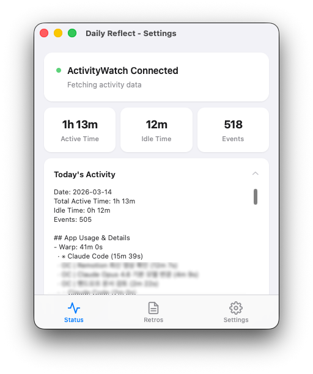
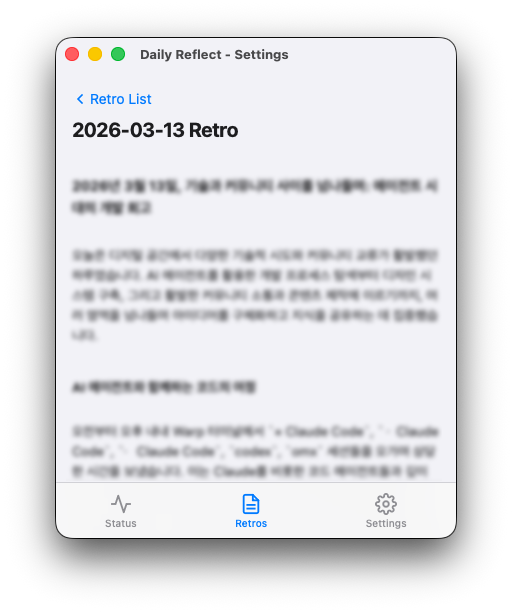
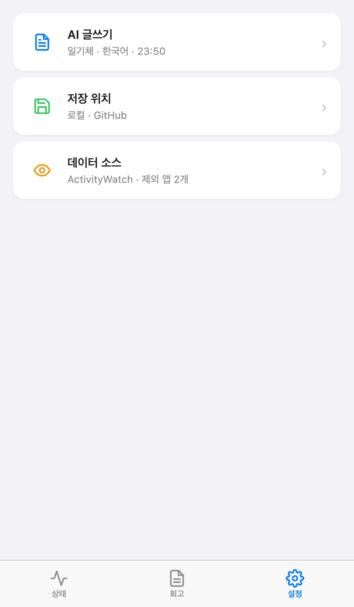

# Daily Reflect

🌐 [한국어](README.ko.md) | [English](README.md)

A desktop app that analyzes your daily activity and automatically writes a reflection journal.

Based on activity data collected by [ActivityWatch](https://activitywatch.net/), Gemini AI generates a daily reflection at a scheduled time. The generated entry is automatically saved to a local markdown file, GitHub, and Notion.

## Features

- **Automatic Activity Tracking** — Integrates with ActivityWatch to monitor app usage time and active/idle time in real time
- **AI-Generated Reflections** — Gemini 2.5 Flash analyzes your day and writes a reflection at a scheduled time each day
- **Multiple Storage Targets** — Save simultaneously to local markdown, a GitHub repository, and a Notion database
- **Custom Writing Style** — Write in diary, blog, bullet-point, or a custom tone you define
- **Multilingual Support** — Korean, English
- **System Tray Resident** — Runs in the background with quick access via the tray menu
- **Fully Local Data** — All activity data is processed locally; nothing is sent to external servers

## Screenshots

| Status | Reflection | Settings |
|:---:|:---:|:---:|
|  |  |  |

## Getting Started

### 1. Install ActivityWatch

Daily Reflect requires [ActivityWatch](https://activitywatch.net/) to collect activity data.

| OS | Download |
|---|---|
| macOS | [ActivityWatch-macos.dmg](https://activitywatch.net/downloads/) |
| Windows | [ActivityWatch-windows.exe](https://activitywatch.net/downloads/) |
| Linux | [ActivityWatch-linux.zip](https://activitywatch.net/downloads/) |

1. Download the installer for your OS from the link above
2. Install and launch ActivityWatch (an icon will appear in the menu bar / system tray)
3. Confirm it is running by opening the ActivityWatch dashboard at `http://localhost:5600`

> ActivityWatch is an open-source (MPL-2.0) activity tracker that stores all data locally.

### 2. Install Daily Reflect

#### Use the Pre-built App (Recommended)

Download the file for your OS from the [latest release](https://github.com/junghwaYang/daily-reflect/releases/latest):

| OS | File | Notes |
|---|---|---|
| **macOS** | `Daily_Reflect_x.x.x_universal.dmg` | Intel & Apple Silicon ([설치 안내](#macos-first-launch)) |
| **Windows** | `Daily_Reflect_x.x.x_x64-setup.exe` | Installer (recommended) |
| **Linux** | `Daily_Reflect_x.x.x_amd64.AppImage` | No install needed, just run |
| **Linux (Debian/Ubuntu)** | `Daily_Reflect_x.x.x_amd64.deb` | `sudo dpkg -i *.deb` |

#### macOS First Launch

Since Daily Reflect is not notarized with Apple, macOS Gatekeeper may block it on first launch.

1. Open **System Settings → Privacy & Security**
2. Scroll down to find the message about "Daily Reflect"
3. Click **Open Anyway**

Alternatively, right-click the app → **Open** → **Open** in the confirmation dialog.

#### Build from Source

```bash
# Clone the repository
git clone https://github.com/junghwaYang/daily-reflect.git
cd daily-reflect

# Install dependencies
pnpm install

# Run in development mode
cd apps/agent
npx tauri dev

# Production build
npx tauri build
```

**Build Requirements:**
- Node.js 18+
- pnpm 9+
- Rust 1.75+
- [Tauri 2 prerequisites](https://v2.tauri.app/start/prerequisites/)

### 3. Initial Setup

On first launch, the app automatically checks the ActivityWatch connection status.

1. **ActivityWatch Connection** — If AW is running, it is detected automatically and the main screen is shown
2. **AI Setup** — Enter your Gemini API key under Settings > AI Writing
3. **Storage Setup** — Enable your preferred storage targets under Settings > Save Location
4. **Generation Time** — Set the daily auto-generation time under Settings > AI Writing (default: 23:50)

### Getting a Gemini API Key

1. Go to [Google AI Studio](https://aistudio.google.com/apikey)
2. Click "Create API Key"
3. Paste the generated key (`AIza...`) into the app settings

## Usage

### Status Tab

- Check the ActivityWatch connection status
- View today's active time, idle time, and event count in real time
- See detailed per-app activity breakdown

### Reflection Tab

- Browse the list of automatically generated reflections
- Click any entry to read the full content
- Use the "Generate Reflection Now" button to trigger generation immediately

### Settings Tab

#### AI Writing
- **API Key** — Gemini API key
- **Writing Tone** — Diary / Blog / Bullet Points / Custom
- **Language** — Korean / English
- **Generation Time** — Daily auto-generation time (HH:MM)

#### Save Location
- **Local Storage** — Saves to a specified folder in `YYYY/YYYY-MM-DD.md` format
- **GitHub** — Auto-commits to a specified repository (Personal Access Token with `repo` scope required)
- **Notion** — Creates a new page in a specified database (Internal Integration Token required)

#### Data Sources
- Check ActivityWatch connection status
- Manage the list of apps to exclude from reflections

## Project Structure

```
daily-reflect/
├── apps/
│   ├── agent/                  # Tauri desktop app
│   │   ├── src/                # Frontend (HTML/CSS/JS)
│   │   │   ├── index.html
│   │   │   ├── main.js
│   │   │   └── styles.css
│   │   └── src-tauri/          # Backend (Rust)
│   │       └── src/
│   │           ├── main.rs     # Tauri entry point
│   │           ├── lib.rs      # Main app logic, commands, scheduler
│   │           ├── tracker.rs  # ActivityWatch API client
│   │           ├── ai.rs       # Gemini AI integration
│   │           ├── config.rs   # Configuration management (JSON)
│   │           ├── buffer.rs   # SQLite local storage
│   │           ├── github.rs   # GitHub Contents API integration
│   │           ├── notion.rs   # Notion API integration
│   │           └── tray.rs     # System tray menu
│   └── web/                    # Landing page (Next.js)
├── docs/                       # Documentation and screenshots
├── packages/
│   └── shared/                 # Shared types/constants
├── supabase/                   # DB schema and seeds
├── .github/workflows/          # CI/CD (GitHub Pages deploy)
├── turbo.json
├── pnpm-workspace.yaml
└── package.json
```

## Tech Stack

| Area | Technology |
|---|---|
| Desktop Framework | Tauri 2 |
| Backend | Rust |
| Frontend | HTML/CSS/JS (vanilla) |
| AI | Gemini 2.5 Flash |
| Activity Tracking | ActivityWatch API |
| Local DB | SQLite (rusqlite) |
| External Storage | GitHub API, Notion API |
| Web | Next.js 16, React 19, Tailwind CSS 4, shadcn/ui |
| DB | Supabase (PostgreSQL) |
| Build | pnpm + Turborepo |

## Privacy

- All activity data is collected and processed **locally only**
- ActivityWatch data is accessed exclusively from `localhost:5600`
- Activity summaries are sent to the Gemini API only when generating a reflection
- GitHub/Notion storage operates only when explicitly enabled by the user

## Deployment

The landing page is automatically deployed to **GitHub Pages** when changes are pushed to the `main` branch under `apps/web/`.

- **URL**: [https://junghwayang.github.io/daily-reflect](https://junghwayang.github.io/daily-reflect)
- **Workflow**: `.github/workflows/deploy-web.yml`
- **Trigger**: Push to `main` (paths: `apps/web/**`)

## License

MIT

## Contributing

Issues and PRs are welcome. Please submit bug reports or feature requests on the [Issues](https://github.com/junghwaYang/daily-reflect/issues) page.
